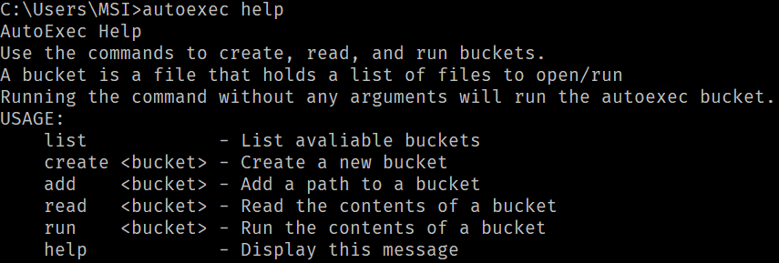

# Introduction

Autoexec is a simple CLI that allows users to add programs and apps to a list, aka a bucket, that can be ran at any time to launch said apps. One special bucket, named autoexec, will auto launch on system startup which is useful for those apps that you always want open such as Spotify or Discord.

## What is this project?

I needed an excuse to re learn Go, and decided to make this project as it was always in the back of my mind. I always liked the idea of an automatic script executing that opens all the apps that I need when im coding, playing games, or any other activity. This project was inspired by CS:GO where players implement a script that starts when the game launches in order to initialize their settings, as well as add unique bindings and other small tweaks. 

## Installation

In order to use autoexec, all you need to do is install the executable file from [the GitHub repository](https://github.com/JaiiR320/AutoExec). You do need to add the folder `C:/Dev/Autoexec/` and put the exe there. This will be changed in the future. Also add another folder, `C:/Dev/Autoexec/buckets` in order to store bucket files. Finally you need to add the exe to your system's `PATH` environment variable. 

## Verify Installation
To verify that everything is working, you can open up a windows command prompt and type `autoexec` and it should start up, and run an autoexec if you have one already initialized. 

